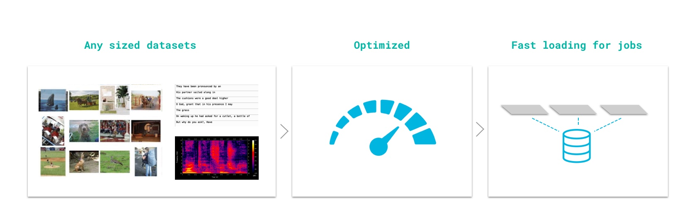
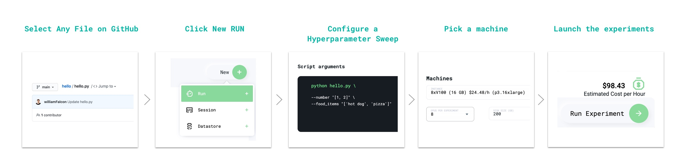

# Grid in 3 minutes

## Introduction

Grid is designed for developing and training deep learning models at scale.

The TL;DR of using Grid is this:

* Create a **DATASTORE** with your dataset.
* Spin up an interactive **SESSION** to develop, analyze and prototype models/ideas.
* When you have something that works, train it at scale via **RUN.**

This 3-minute video shows you how to execute code on cloud instances with zero code changes and how to debug/prototype and develop models with multi-GPU cloud instances.



Here is a quick overview of

\*\*\*\*[**Datastores**](products/add-data-to-grid-datastores/#datastores-scalable-datasets)\*\*\*\*

\*\*\*\*[**Sessions**](products/sessions/#sessions)\*\*\*\*

\*\*\*\*[**Runs**](products/run-run-and-sweep-github-files/#runs)\*\*\*\*

## **Infrastructure is gone**

Grid allocates all the machines and GPUs you need on demand, so you only pay for what you need when you need it.

Grid lets you focus on your work, NOT on the infrastructure

## Artifacts, logs, etc...

Grid handles all the other parts of developing and training at scale:

* Artifacts
* Logs
* Metrics
* etc...

Just run your files and watch the magic happen

## Experiment managers

Grid works with the experiment manager of your choice!!🔥🔥

No need to change your code!

## Datastores: \(scalable datasets\)

In Grid, we've introduced _Datastores_, high-performance, low-latency, versioned datasets.



The UI supports creating Datastores of &lt; 1 GB



Use the CLI for larger datastores

```bash
grid datastores create --source imagenet_folder --name imagenet
```

## Sessions \(interactive machines\)

For prototyping/debugging/analyzing, sometimes you need a LIVE machine. We call these _Sessions_.

**Web UI: Starting a new session**




\*\*\*\*

**CLI: Starting a new session**

```bash
# session with 2 M60 GPUs
grid session create --instance_type 2_m60_8gb
```

## **RUN \(Sweep and train anything\)**

RUN **any** public or private repository with Grid in 5 steps:



This 1-minute video shows how to RUN from the web app:



If you prefer to use the CLI simply replace python with grid run.


First, install Grid and login

```bash
pip install lightning-grid --upgrade
grid login
```

Now clone the repo and hit run!

```bash
# clone repo
git clone https://github.com/williamFalcon/hello
cd hello

# start the sweep
grid run hello.py --number "[1, 2]" --food_item "['pizza', 'pear']"
```

This command produces these equivalent calls automatically

```bash
python hello.py --number 1 --food_item 'pizza'
python hello.py --number 2 --food_item 'pizza'

python hello.py --number 1 --food_item 'pear'
python hello.py --number 2 --food_item 'pear'
```

## That's it!

We learned that:

* **RUN** executes scripts on cloud machines \(and runs hyperparameter sweeps\)
* **SESSION** starts an interactive machine with the CPU/GPUs of your choice
* **DATASTORE** is an optimized, low-latency auto-versioned dataset.
* Grid has a **Web app** and a **CLI** with similar functionality.

That's all you need to know about Grid!

## Next

Try our [first tutorial](start-here/typical-workflow-web-user.md)...

