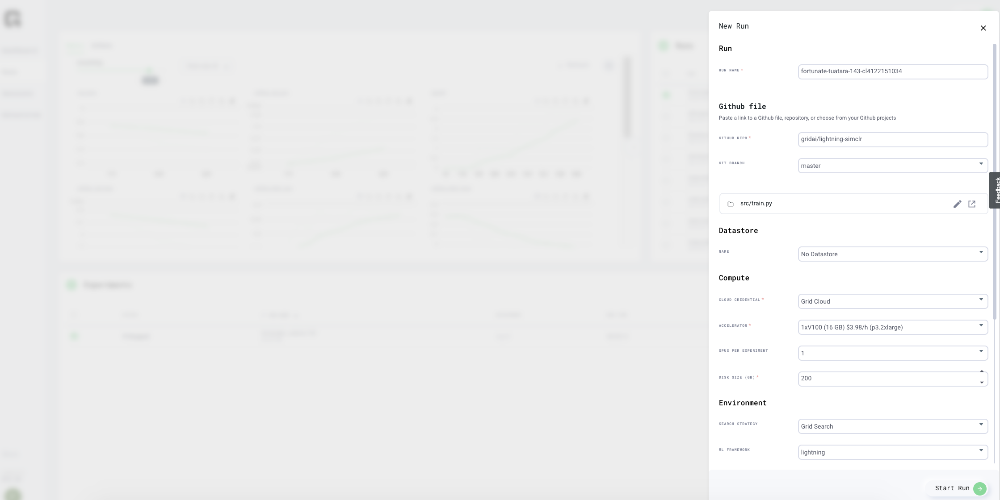
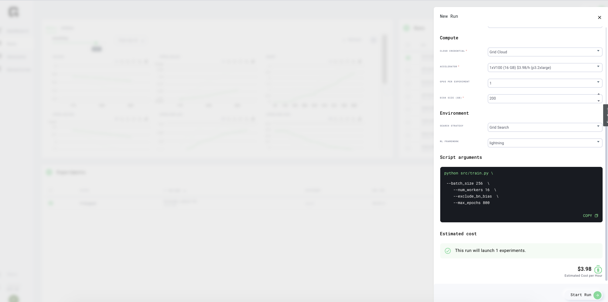
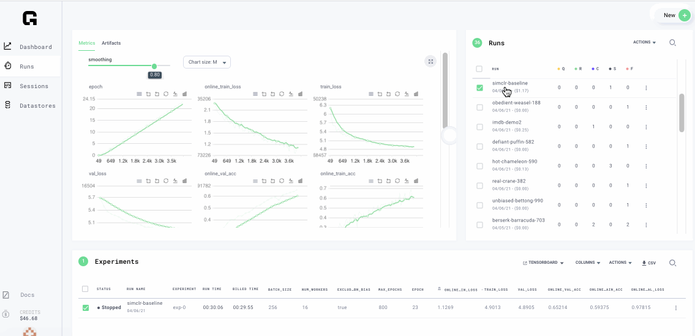
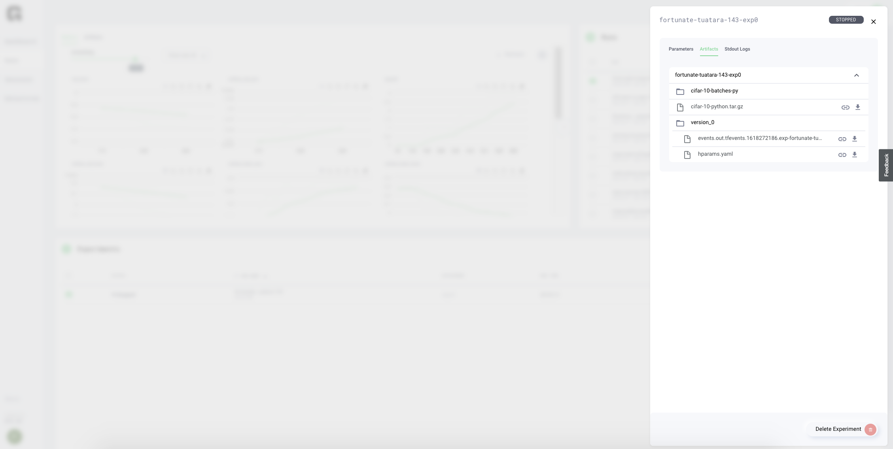

# SIMCLR

## Goal

This example covers the Self supervised learning deep learning task.

Tutorial time: 5 minutes

1. Start New Run with 1 GPU
2. Visualize Experiments
3. Download artifacts
4. Update to run with 8 GPUs

## Overview

In Self supervised learning \(SSL\), input data is not provided with labels. Rather, input data is divided into parts where some parts are suppressed with a mask and then model is trained to predict the data that is missing. [Self supervised ](https://pytorch-lightning-bolts.readthedocs.io/en/latest/self_supervised_models.html)methods for image classification are becoming popular, this tutorial shows an example

We will be using this repository: [https://github.com/gridai/lightning-simclr](https://github.com/gridai/lightning-simclr) an implementation in [PyTorch Lightning ](https://github.com/PyTorchLightning/pytorch-lightning)framework

### Dataset

The dataset used is [CIFAR-10](https://www.cs.toronto.edu/~kriz/cifar.html), collection of images in 10 different classes. However there is no need to upload data for this example, the repository includes functions to download

### Model

A Simple Framework for Contrastive Learning of Visual Representations \([SimCLR](https://arxiv.org/abs/2002.05709)\) is used for this example. If you are interested to see the code it is [here](https://github.com/gridai/lightning-simclr)

## Step 1: Start a new Run

Use the Web Interface, select New Run and choose this script: [https://github.com/gridai/lightning-simclr/blob/master/src/train.py](https://github.com/gridai/lightning-simclr/blob/master/src/train.py)



Add script arguments to set batch size, number of workers etc

```bash
    --batch_size 256 \
    --num_workers 16 \
    --exclude_bn_bias \
    --max_epochs 800
```



Model starts to train.

## Step 2: Visualize the experiments

Visualize training on the Web interface, see metrics and download checkpoints from the run



## Step 3: Download artifacts

Navigate to experiment details and download the artifacts



## Bonus: Run on CLI with 8 GPUs

Run same example with 8 V100, notice how fast model trains

```text
grid run \
    --instance_type 1_v100_16gb \
    --gpus 8 \
    src/train.py \
    --gpus 8 \
    --batch_size 256 \
    --num_workers 16 \
    --exclude_bn_bias \
    --max_epochs 800
```

