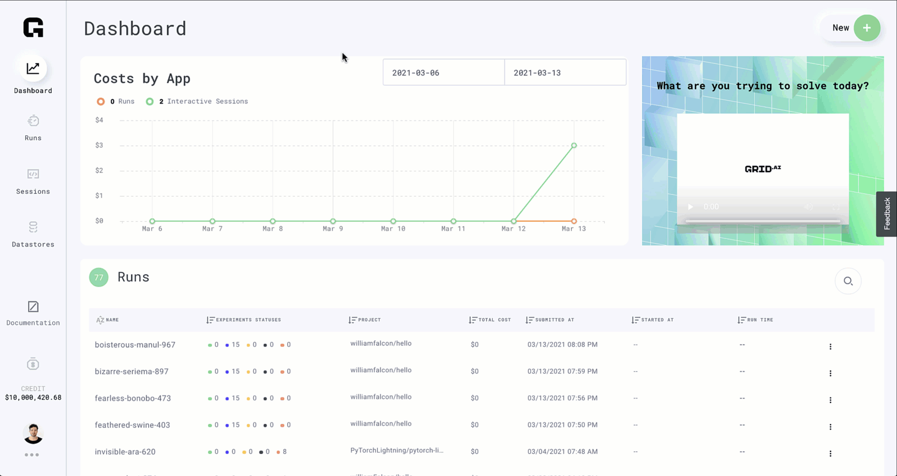

# Add custom cloud credential

## Add custom cloud credential

### Add custom cloud credential

#### Custom cloud credentials

Grid can orchestrate infrastructure on your own AWS account by simply adding your own AWS credentials.



#### Early access


Using your own AWS credentials with Grid is currently in closed early access.


[REQUEST early access to this feature](https://forms.gle/CDk9yajbA5MWSRKM8)

#### Step 1: Get AWS credentials

**A: Login to AWS and search for IAM**

Login into your AWS account. You will then use the search bar to find "IAM" \(user management\).


**B: Click on "Users"**

Click on the "Users" panel. You will be able to see a list of users. If you already have a user, click on your user name. If you don't, move to the next step to create a new user.


**C: Create New User \(optional\)**

If you don't have a user available and would like to create one, on the "Users" page click on "Add user". Fill in the user name of your preference and make sure to check "Programmatic access" \(this allows you to use AWS keys\).


Click on "Next: Permissions" &gt;

The user should have IAMFullAccess privileges.

Click on "Next: Tags" &gt; "Next: Review" &gt; "Create user".

**D: Create New AWS Keys**

1. Navigate to the "Users" page
2. Click on your user name
3. Click on the tab "Security Credentials"
4. Click on "Create access key"
5. Copy both the "Access key ID" and the "Secret access key" values


The "Secret access key" value will only be shown once. Make sure you copy that value and store it in a safe location.


Make sure that your user name has the right policies attached in order to user Grid correctly. Refer to the section [Adding Grid AWS Policies & Roles](https://docs.grid.ai/platform/about-these-features/adding-custom-cloud-credentials#step-2-add-iam-permissions-to-your-account) for more details.

#### Step 2: Add IAM permissions to your account

The user you just created, and fetched credentials for should have IAMFullAccess privileges.


Reach out to us via Slack or email if you have any issues creating the following AWS roles and policies. We're happy to help!


**A: Add Policies to Your Account**

The final step is to add all the Grid policies to your account. That means that your AWS keys will now be able to perform the operations required by Grid.

1. First, log in to AWS and navigate to IAM
2. Click on "Users"
3. On the user's page, find your user name and click on it
4. Click on "Add permissions"
5. Click on "Attach existing policies directly"


1. Search for the policy IAMFullAccess:  
2. Click the Check Box to the left of `IAMFullAccess`
3. Click on "Next:Review"
4. Click on "Add permissions"

Now that you have added the right permissions to your user name, you can use the user's AWS API keys with Grid.

#### Step 3: Create Role & Policy grid requires

For the next step you're going to create role we're going to assume into. For this you'll be using terraform. Make sure you have `git`, `terraform`, `jq` and `AWS CLI` installed on your machine. Installation instruction of these tools are [available](adding-custom-cloud-credentials.md#installing-3rd-party-tools). If you're familiar with terraform we recommend you check the terraform module we'll be using to create necessary roles & policies. [https://github.com/gridai/terraform-aws-gridbyoc](https://github.com/gridai/terraform-aws-gridbyoc) This module is published on official terraform registry for your convenience [https://registry.terraform.io/modules/gridai/gridbyoc/aws/latest](https://registry.terraform.io/modules/gridai/gridbyoc/aws/latest)

For quick start

* Clone the repo

```bash
git clone https://github.com/gridai/terraform-aws-gridbyoc.git
cd terraform-aws-gridbyoc/quick-start
```

* Make sure your AWS CLI is properly configured with [id & secret you created](adding-custom-cloud-credentials.md#d-create-new-aws-keys).  These are not shared with Grid.

```bash
unset AWS_ACCESS_KEY_ID
unset AWS_SECRET_ACCESS_KEY
unset AWS_SESSION_TOKEN

aws configure

# prompt and example entries below

AWS Access Key ID [None]: xxxxxxxxx
AWS Secret Access Key [None]: xxxxxxxxx
Default region name [None]:
Default output format [None]:
```

* Verify AWS Access Key 

```bash
aws sts get-caller-identity

# example entries below should match the above steps
{
    "UserId": "xxxxxxxxx",
    "Account": "xxxxxxxxx",
    "Arn": "arn:aws:iam::xxxxxxxxx:user/xxxxxxxxx"
}
```

* Run the Terraform script and enter the AWS Region when prompted. The region where the VPC is located is entered during the in the [later step.](adding-custom-cloud-credentials.md#step-4-register-your-role-in-grid)

```bash
terraform init
terraform apply

# enter provider.aws.region
provider.aws.region
  The region where AWS operations will take place. Examples
  are us-east-1, us-west-2, etc.

  Enter a value: <us-east-1>

# long list of actions truncated and the final prompt

Do you want to perform these actions?
  Terraform will perform the actions described above.
  Only 'yes' will be accepted to approve.

  Enter a value: yes
```

* Get the output from terraform. By default terraform hides the sensitive secret output

```bash
terraform output -json | jq
```

From the last command you'll get the following output:

```javascript
{
  "external_id": {
    "sensitive": true,
    "type": "string",
    "value": "<example-id>"
  },
  "role_arn": {
    "sensitive": false,
    "type": "string",
    "value": "<arn:aws:iam::000000000000:role/example-role>"
  },
  "role_name": {
    "sensitive": false,
    "type": "string",
    "value": "example-role"
  }
}
```

* Save `EXTERNAL_ID` and `ROLE_ARN` for use in [later steps](adding-custom-cloud-credentials.md#step-4-register-your-role-in-grid). 

```bash
export EXTERNAL_ID=$(terraform output -json | jq -r '.external_id.value')
export ROLE_ARN=$(terraform output -json | jq -r '.role_arn.value')
```

#### Step 4: Register your role in grid

By default, Grid Sessions and Runs are spun up in Availability Zone `a` currently. Only specify the AWS region and not the AZ in the `--region` argument.

* Login to Grid.  Please reference the detailed [steps](https://docs.grid.ai/products/global-cli-configs#install-the-cli) as required. 

```bash
pip install lightning_grid --upgrade 
grid login --username <Grid user name> --key <Grid API Key>
```

* Create cluster in default region with default instance types

```bash
grid clusters aws --role-arn $ROLE_ARN --external-id $EXTERNAL_ID <cluster name>
```

* Create cluster in `us-west-2` region with default instance types

```bash
grid clusters aws --role-arn $ROLE_ARN --external-id $EXTERNAL_ID --region us-west-2 <cluster name>
```

* Create cluster in `eu-west-2` region with `t2.medium` and `t2.xlarge` instance types

```bash
grid clusters aws --role-arn $ROLE_ARN --external-id $EXTERNAL_ID --region us-west-2 --instance-types t2.medium,t2.large <cluster name>
```

#### Step 5: Wait for cluster to be provisioned

```text
grid clusters
```

And wait for your cluster status be `running`:

```text
┏━━━━━━━━━━━━━━━━━━━━┳━━━━━━━━━━━━━━━━━━━━┳━━━━━━━━━┓
┃ id                 ┃ name               ┃ status  ┃
┡━━━━━━━━━━━━━━━━━━━━╇━━━━━━━━━━━━━━━━━━━━╇━━━━━━━━━┩
│ grid-cloud-prod    │ grid-cloud-prod    │ running │
│ <cluster name>     │ <cluster name>     │ running │
└────────────────────┴────────────────────┴─────────┘
```

It can take some time to provision a new cluster, ~20-30 minutes

#### Step 6: Run your workloads in your new cluster

```text
grid run --cluster <cluster name>
grid session --cluster <cluster name>  create
```

Or if you're using config file set the `.compute.provider.cluster` field to the cluster name you've just provisioned

#### Step 7: Enjoy

## Installing 3rd Party Tools

Installation steps of the following tools are covered.

* git
* [jq](https://stedolan.github.io/jq/)
* [terraform](https://www.terraform.io/) 
* [AWS CLI](https://aws.amazon.com/cli/) 

### OSX

[brew](https://brew.sh/) and [pip3](https://packaging.python.org/guides/tool-recommendations/) are used in this example.

```bash
brew install git
brew install terraform 
brew install jq
pip3 install awscli --upgrade --user
```

### Linux \(Debian/Ubuntu\)

[Grid Session SSH](https://docs.grid.ai/products/sessions/how-to-ssh-into-a-session) can be used to run the below example. [apt-get](http://manpages.ubuntu.com/manpages/cosmic/man8/apt-get.8.html) and [repository configuration](https://www.terraform.io/docs/cli/install/apt.html#repository-configuration) are used in this example.

```bash
# add hashicorp repo
sudo apt-get install gpg
sudo apt-get install software-properties-common
curl -fsSL https://apt.releases.hashicorp.com/gpg | sudo apt-key add -
sudo apt-add-repository "deb [arch=$(dpkg --print-architecture)] https://apt.releases.hashicorp.com $(lsb_release -cs) main"

# install the tools
sudo apt-get install git
sudo apt-get install terraform 
sudo apt-get install jq
sudo apt-get install awscli
```

