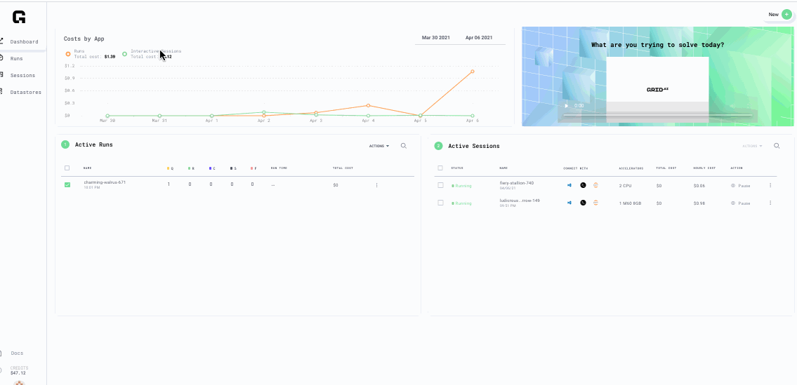
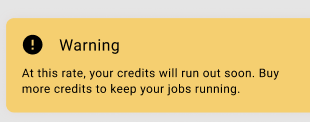

# Keeping track of costs

## Dashboard View

The dashboard page shows a graph of runs and interactive sessions and associated costs. You can also see what is currently active.


All costs are estimates until runs or Sessions are complete


Runs and Sessions pages also show the cost per experiment and cost of each session; the dashboard is the easiest way to see the costs.

## Low Balance Warning

If the balance goes below $10, Grid will warn you about "low balance remaining"

Zero balance will prompt a shut down of interactive sessions as well as active runs.

