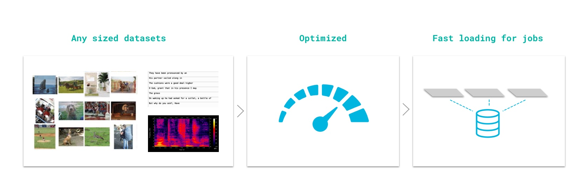

# ⚡Datastores

## Datastores \(scalable datasets\)

In Grid, we've introduced _Datastores_, high-performance, low-latency, versioned datasets.

Datastores can be attached to Runs or Sessions whenever your job needs data.




We don't charge for data storage!


## Product Tour

Upload data to Grid using Datastores. Datastores are low-latency, auto-versioned datasets.

[Click here for the 1-minute product tour](https://platform.grid.ai/#/dashboard?product_tour_id=221979)


## Data inside the model script

Perhaps the simplest way is when your model script downloads the data.

Let's illustrate with PyTorch:

```python
from torchvision.datasets import MNIST
from torchvision import transforms

# this line automatically downloads data
dataset = MNIST(os.getcwd(), download=True, transform=transforms.ToTensor())
```

Pros:

* Simplest approach
* Enables the fastest iteration

Cons:

* Downloads every time a job starts
* Spends compute money on data downloading

## Datastore paths

Once you have created a datastore, simply pass in its name to your script and Grid will auto-resolve the path. Assume you have a datastore named _cats_ and you want to use version 1:

```bash
grid run main.py --data_dir grid:cats:1
```

