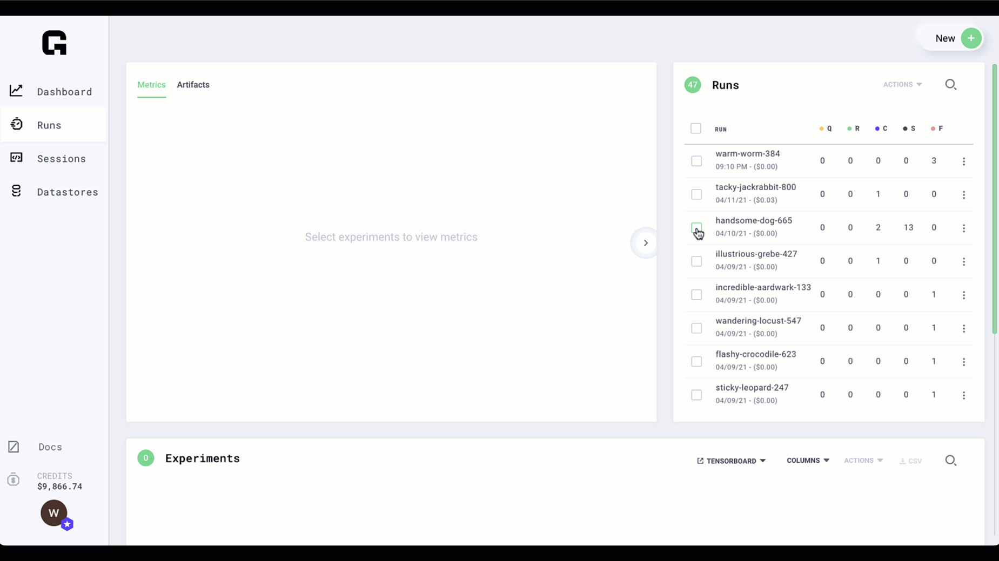

# Artifacts

## Saving artifacts

Anytime your script saves artifacts, Grid captures those for you. It does not matter which folder you save artifacts to... Grid will automatically detect those.

Try [hello.py](https://github.com/williamFalcon/hello/blob/main/hello.py) for an example


## Access artifacts via the UI

Artifacts are the output produced by the training process.

To access artifacts:

* Select the experiments
* Click artifacts



## Share artifacts

Click the link to the right of the artifact to copy the link



Artifact links have an expiration of 24 hours.


## Access artifacts via the CLI

To get artifacts via the CLI, find the run name \(via the UI or CLI\)

```bash
# if it's still running
grid status

# if it's completed
grid history
```

### Artifacts for a run

Get the artifacts for a run

```bash
grid artifacts run-name
```

### Artifacts for an experiment

```bash
# view the experiments in the run
grid status run-name
```

get the artifacts

```bash
# get the artifacts (downloads by default to /grid_artifacts)
# N in expN means the ith experiment (ie: exp0, exp1, exp3, ..., expN)
grid artifacts runname-expN
```

