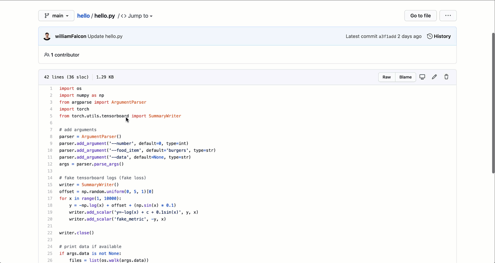

# Attaching Datastores

## Attach to a RUN



When attaching datastores to a run, take note of the path your script uses. For example if your script takes an argument _my\_data\_path_ and you want to mount the _cats_ datastore:

```bash
grid run main.py --my_data_path grid:cats:1
```

## Datastore paths

Say you have a dataset with this structure:

```bash
my_dataset /
  train/
    ...
  val/
    ...
```

on your local machine, you call the script like so,

```bash
python main.py --root my_dataset/
```

your script uses the dataset like this,

```python
args.add_argument('-root')
root = args.parse_args()

train = load(root + 'train')
val = load(root + 'val')
```

When you upload a datastore to Grid:

```bash
grid datastores create --source my_dataset --name apples
```

it is available under this structure:

```bash
train/
  ...
val/
  ...
```

To run on this datastore, select the datastore from the dropdown


Now pass the name of the datastore to your command


which is equivalent to calling your script like so:

```bash
# python
python pl_mnist.py --root /opt/datastore

# with grid
python pl_mnist.py --root grid:my-dataset:1
```

The datastore path has 3 parts:

```bash
grid:[name]:[version]
```

Example, datastore named elephant \(version 3\)

```bash
grid:elephant:3
```

