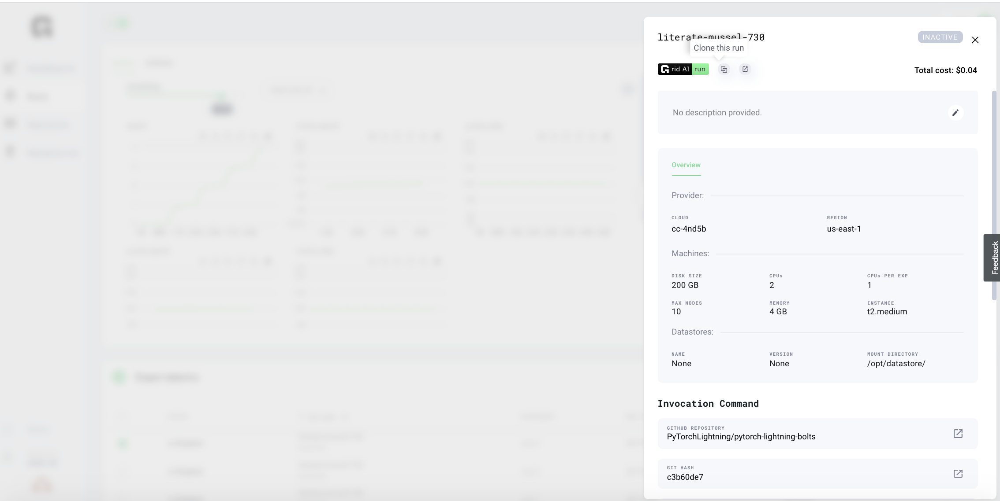

# Clone Runs or Experiments

## Clone a run

To re-run a run or experiment you have already ran once, use the **clone icon.**

* Select the run \(or experiment\)
* Click the clone button
* Click start

## Use cases

Cloning is helpful if:

* A run fails because of hyperparameters
* You want to start a derivative of an experiment or run.

