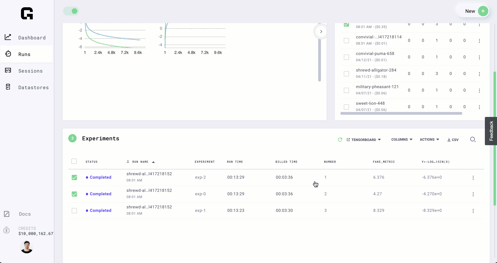

# Failed jobs

When your jobs fail it could be for 2 reasons, something failed during build or something failed while running

## Build failures

To see build failures, visit the build logs tab on the UI.

Failures at this stage can happen because:

* Dependencies fail to install
* An action can fail
* Something goes wrong when executing your script

## Script failures

If the build completes but your script has a failure \(ie: bug that causes exception\) view the logs here

Failures here can happen with:

* Passing the wrong script arguments
* Out of memory
* Issue accessing the data
* A bug in your script that throws an exception

