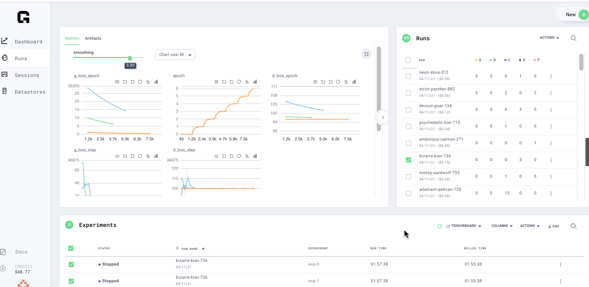

# Metrics \(charts\)

## Web Interface view

View the metrics of experiments by choosing Run then experiments

## Tensorboard

Tensorboard can be launched in a new tab in the browser by selecting Tensorboard -&gt;refresh

In the Experiments table view, select hyper parameters used to run experiments

