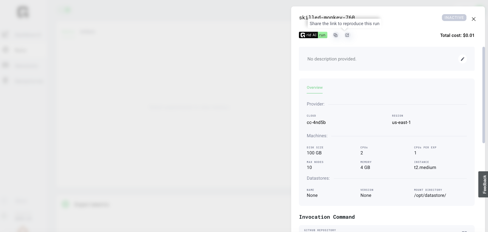

# Sharing Runs

## Sharing Reproducible Runs

Sharing of runs is possible when runs are completed. 

When experiments complete, simply open the Run details, click on "share the link and reproduce this run' icon. This action copies the url which can be pasted to share with a colleague. 

As long as colleague has created account on Grid.ai, she can copy and paste in browser to run the same experiment in Grid platform in her account.

