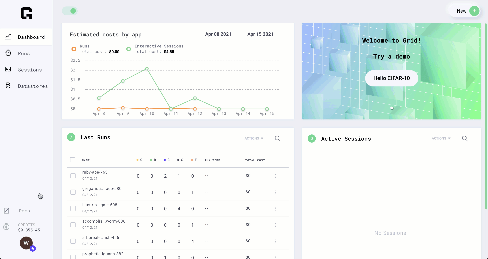
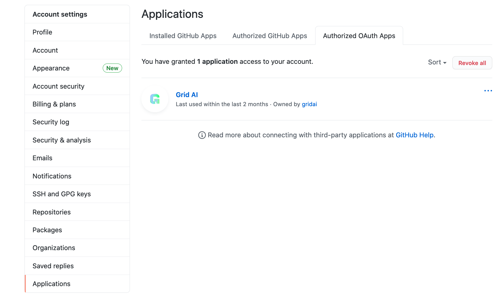
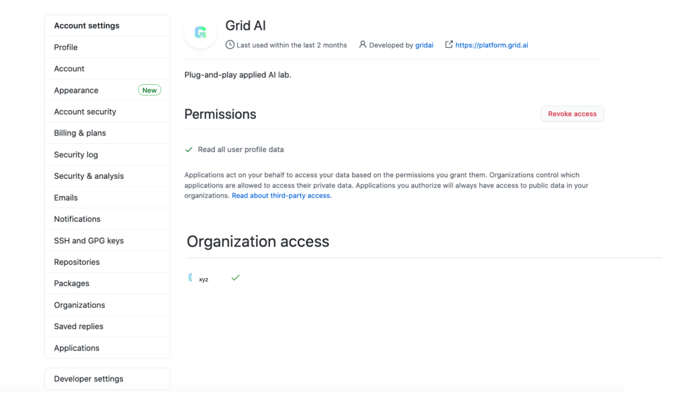

# Github login

Interactive Sessions automatically login into Github for you. You can clone any repositories into a Session using the [HTTPS cloning method](https://docs.github.com/en/github/creating-cloning-and-archiving-repositories/cloning-a-repository#cloning-a-repository-using-the-command-line) \(SSH will not work\).

## Signed up with Github

If you signed up to Grid with Github, you'll already be logged into your Github account when an interactive Session starts.

## Signed up with Google

If you signed up to Grid with Google, you'll have to link a Github account under **Settings** &gt; **Integrations**.

## Access Private Github Repos

By default you can only access public Github repositories on Grid. To grant access to your private code navigate to Settings &gt; Integrations &gt; Grant access.

## About authorization

When you grant access to private repositories in Github, the organizations that you have granted private access to will appear in [https://github.com/settings/applications](https://github.com/settings/applications) .  When you want to use a script from a private repository in Grid, make sure that the organization shows up in the Applications section of Github settings

Click on the Grid AI organization to see permissions.

Make sure that Organization access above shows that permissions are granted to the repositories you have\(this example is showing xyz\). If Organization access is not requested, you will not be able to use scripts from the private repositories.

## About private code

Grid does not save your code, look at it or compromise its privacy in any way.

When receiving support, you will not have to share any code to help debug. If you choose to share code, make sure you have the rights to and share non-critical parts of the code.

