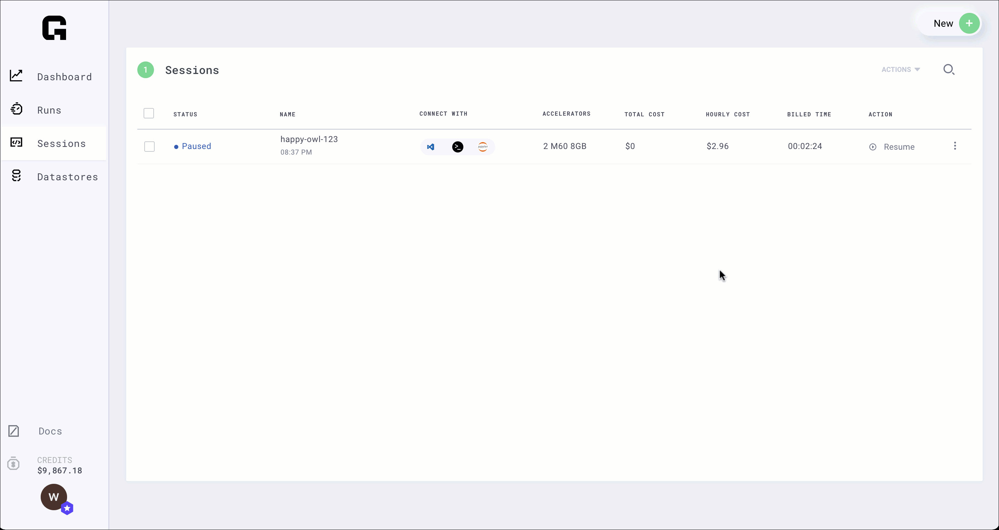

# Pause

## Pause a Session

You've spent hours configuring a Session with all your code, dependencies etc, but now you want to pause so you don't get charged without losing your state.

Use the **pause** feature for this.

You will NOT be charged for paused Sessions.


The equivalent via the CLI

```bash
grid session pause the-interactive-name
```

## Restart a Session

When you're ready to rebuild your session environment, press restart.



The equivalent via the CLI

```bash
grid session resume the-interactive-name
```

