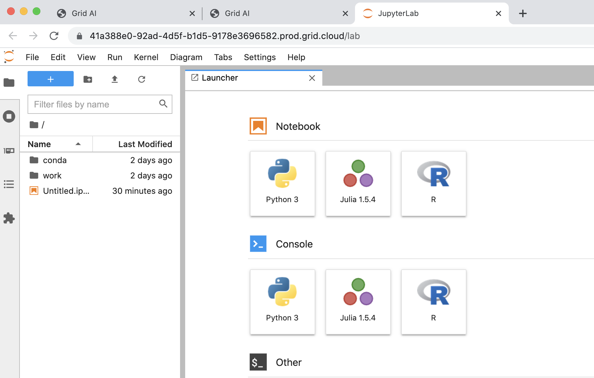

# Julia and R languages in Sessions

## Julia and R languages in addition to Python

Sessions are now updated with support for Julia and R programming languages

## Step 0: Create a Session

Create a session as you would normally

## Step 1: Open Jupyterlab

Click on Jupyterlab icon in the session, you are now able to use Julia and R programming languages in addition to python

