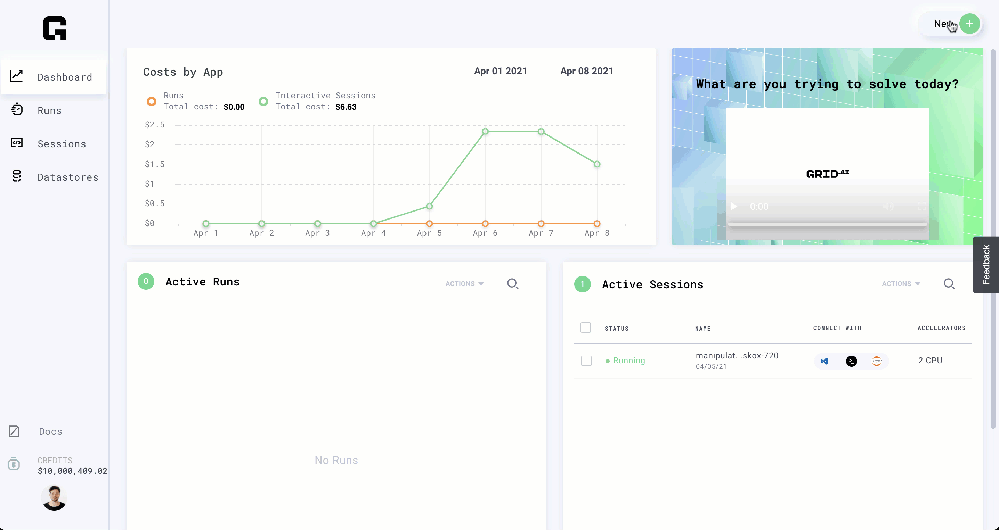

# Typical workflow \(web user\)

## Goal

The goal of this tutorial is to walk through a typical workflow using the Grid Web app.

For users who prefer the command-line \(CLI\)  [this is the mirror tutorial for the CLI](typical-workflow-cli-user.md)


Grid has a 1:1 match in functionality with the CLI. 


We'll use image classification as an example to illustrate the key ideas.  The typical workflow goes like this:


Note a few things:

* The dataset is small so the tutorial can be quick. But the workflow doesn't change for large-scale data.
* We'll use PyTorch Lightning for simplicity, but the framework can be any of your choice.

## **Tutorial time: 16 minutes**

| time | step |
| :--- | :--- |
| 2 minutes | Preparing the dataset |
| 2 minutes | Creating a **Datastore** |
| 2 minutes | Starting a **Session** |
| 5 minutes | develop the model |
| 1 minute | Pause the **Session** |
| 1 minute | Run \(hyperparameter sweep\) |
| 3 minutes | Bonus: Become a power user |


## Terminology Glossary

| Term | Description |
| :--- | :--- |
| CIFAR-5 | A dataset with 5 classes \(airplane, automobile, ship, truck, bird\). |
| grid **datastore** | High-performance, low-latency, auto-versioned dataset. |
| grid **run** | Runs a model \(or many models\) on a cloud machine \(hyperparam sweep\) |
| grid **session** | A LIVE machine with 1 or more GPUs for developing models |
| An experiment | A single model with a given configuration |
| A run | A collection of experiments |
| ssh | A way to connect from a local machine to a remote machine |


## The dataset

For this tutorial we'll be using CIFAR-5. This is a subset of [CIFAR-10](https://www.cs.toronto.edu/~kriz/cifar.html) that we've chosen to make the models train faster.


The goal is to teach a small neural network to classify these 5 sets of classes.

## Step 0: Prepare the dataset


\(Time: **2 minutes**\)

If your dataset is already is in zip/tar/tar.gz format you can create a datastore by simply pasting it into the UI.



But for the sake of simulating a non-trivial workflow where you already have the data locally or on a cluster, go ahead and download the dataset to your machine and unzip it.

* [DOWNLOAD CIFAR-5](https://pl-flash-data.s3.amazonaws.com/cifar5.zip)
* unzip it

You should now have a folder with this structure:


Now that we all have the same data, let's start the real tutorial!

## Step 1: Create a datastore


\(Time: **2 minutes**\)

In a realistic workflow, we would start here. The first thing you want to do is to create a **DATASTORE** on Grid with your dataset. The datastore will optimize your data for low-latency, and high-availability to any machine you run on Grid.

Let's create the datastore:



For datasets 1 GB or larger, use the [CLI](../products/global-cli-configs/cli-api/grid-datastores.md)


## Step 2: Start a session

\(Time: **2 minutes**\)

Now that your data has been uploaded the next step in a real workflow is to spend time doing any of the following:

* Develop/Debug the model
* Prototyping it on multiple GPUs
* Adjusting the batch size to maximize GPU usage
* Using the model for analysis, which might require GPUs
* Explore and visualize the model

This is exactly what _Sessions_ were created for. 

Start a Session named _resnet-debugging_ with 2 M60 GPUs on it and attach our **CIFAR-5** dataset.

**Note: A credit card needs to be added to use GPU machines**


Sessions really shine with **huge datasets**. The automatic mounting feature means you can jump straight to work without waiting a long time for your data to be available.


TIP: If you prefer to ssh directly or use VSCode \(instead of using Jupyter lab\), the other icons have setup instructions. 



## Step 3: Develop the model


\(Time: 5 **minutes**\)

Now that you have your data, code, and 2 GPUs, we get to the fun part! Let's develop the model

For this tutorial, I'm going to use a non-trivial project structure that is representative of realistic use cases \[[code link](https://github.com/williamFalcon/cifar5)\].

The project has this structure


This folder is complicated on purpose to showcase that Grid is designed for realistic deep learning workloads. I'm purposely avoiding simple projects \([code reference](https://github.com/williamFalcon/cifar5-simple)\) that look like this \(since those are trivial for Grid to handle.\)



For best practices structuring machine learning projects in general, [read our guide](https://app.gitbook.com/@grid-ai/s/grid-cli/~/drafts/-MV7NJIqFCxJS-A3u0w3/deep-learning-at-scale/structuring-code-repositories). \(Coming Soon\)


On the session you would normally:

* debug
* develop
* tune batch size
* etc...

We're going to run the model using the following instructions. This GIF illustrates what we are about to do\).


Clone the project **on the interactive Session**

```yaml
git clone https://github.com/williamFalcon/cifar5
```

Install requirements + project

```yaml
cd cifar5

sudo pip install -r requirements.txt
pip install -e .
```

now run the following command to train a resnet50 on 2 GPUs

```bash
python project/lit_image_classifier.py \
                --data_dir ~/datastore \
                --gpus 2 \
                --accelerator 'ddp' \
                --backbone resnet50
```

You should see the results \(the script is designed to overfit the val split\)

```yaml
--------------------------------------------------------------------------------
DATALOADER:0 TEST RESULTS
{'test_acc': 1.0, 'test_loss': 1.2107692956924438}
--------------------------------------------------------------------------------
```

At this step \(in a real workflow\) you would code the model, debug, tune batch size, etc... 

Grid even lets you do this from your local VSCode \([read this guide to set that up](../products/sessions/vscode-with-sessions.md)\).

Once you're ready, commit your changes so we can train at scale

```yaml
git commit -am "changes"
git push
```

## Step 4: Pause the Session

\(Time: 1 **minute**\)

Great! now that our model is ready to run at scale, we can pause the session. Pausing keeps your environment as is so you don't have to rebuild it next time you want to work on this model.

It's a good idea to use a different session per project you're working on, so it's easy to pick up where you left off.



Paused Sessions don't cost you money!


## Step 5: RUN \(hyperparam sweep\)


\(Time: 1 **minute**\)

Once your model is ready to go, you usually want to train it to convergence. If you already know a good set of hyperparameters then your run will be very simple since it will train a single model.

If you'd like to find better hyperparameters for your model, a RUN can launch multiple variations of your model to try all hyperparameters at once.

**First** commit all your changes and push to GitHub

```bash
git commit -am "ready to run"
git push
```

Now let's kick off the RUN.

First, paste this link in the run page.

```bash
https://github.com/williamFalcon/cifar5/blob/master/project/lit_image_classifier.py
```

Add the following args to spin up 10 different experiments

```bash
--data_dir /opt/datastore \
--gpus 2 \
--accelerator 'ddp' \
--learning_rate "uniform(1e-5, 1e-2, 5)" \
--backbone "['resnet18', 'resnet50']"
```




## Bonus: Becoming a power user

\(Time: 3 **minutes**\)

Here are some tricks to get you beyond the basic user status.

### Clone

Let's say you want to start a run again but only change a few arguments. Use the clone button


### Log to tensorboard

Any script that uses tensorboard is compatible with Grid


### Create artifacts

Anything your model produces can be viewed on Grid.


### CLI

Finally... there is a really amazing experience with interactive sessions and run submission via the CLI. 




