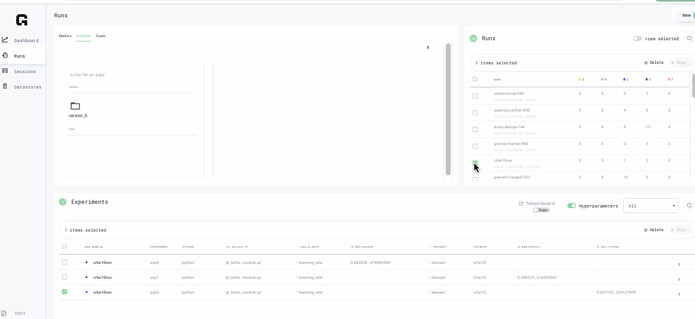

# Changelog

## Keep up with the Product updates on Github!

Make sure to update CLI to the latest



## June 14, 2021

### Added

* Sessions now support Julia and R languages within JupyterLab.
* Utilities added to jupyterlab environments `tree`, `tmux`, and `gpustat`
* The `grid stop` command can be used to stop a session, run, or experiment. Note that using this command for a session will delete the session entirely. To pause a session, continue using `grid session pause`.
* Use the `grid user` command to show information of the logged in user.

### Changed

* Deprecated `grid train` in favor of `grid run`.
* Deprecated `grid interactive` in favor of `grid session`.
* Deprecated `grid cancel` in favor of `grid stop`.

### Fixed

* Fixes an issue with generating ssh keys with whitespace in the ssh comments [\#50](https://github.com/gridai/gridai/issues/50)
* Prevents users from being stuck in a phone verification loop if verification fails initially.
* Improvements to cloning runs - a clone of a spot instance is automatically a spot instance run.
* Fixes live streaming of logs
* Several improvements to documentation, especially to the CLI API reference and training examples

## June 4, 2021

### Added

* New style formatting to CLI help text. Check it out with `grid --help` !
* The `interactive` command is deprecated and will be removed in a later release. Use `session` instead. Example: `grid session pause prudent-ara-859`

### Fixed

* Fixed a bug where in certain cases where spot runs would be killed and restarted
* Fixed a bug with certain disappearing artifacts at the end of trainin

## May 28, 2021

### **Added CLI updates**

* Parameters prefixed with "grid\_" or "g\_" are deprecated and will be removed in a later release. Use their non-prefixed variants instead. For example, `grid run --g_instance_type` is now `grid run --instance_type`
* The CLI command for grid datastores has been updated to `grid datastore {option}`. Ex: Use `grid datastore` to list all existing datastores.
* Use `grid sync-env` to synchronize the requirements file with packages and versions from the currently active environment.
* To open up the CLI docs directly from the terminal, use `grid docs`

## May 6, 2021

### Bug fixes patch release

## May 4, 2021

### Interruptible Machines\(Spot Instances\)



## April 28, 2021

### Sessions

* Jupyterlab images includes less
* Improved status change updates in UI and CLI
* "Connect via SSH" includes full session name

### Datastores

* Mount directory is optional when creating datastores
* Other bug fixes

## April 16, 2021

### Added

* More accurate estimated costs.
* Share button, Github badge and cloning of experiments/runs.
* Dark mode
* Build logs now show up on the details page
* Stdout logs can now be downloaded

### Fixed

* Certain cases where runs would stay queued for a while
* Delays in getting metrics
* Saving large files on Sessions
* Charts not refreshing [\#29](https://github.com/gridai/gridai/issues/29)

## April 13, 2021

We are now live! Grid platform is accessible via our new website: [https://www.grid.ai/](https://www.grid.ai/)

Sign in via Github or gmail and get started!

## April 9, 2021

### UI Enhancements

When you log in to Grid, you will be asked for phone verification. This is for security reasons. You will  be doing this only once.

New Run workflow is simplified with less steps, three frameworks to choose from.

Hyper parameter values have better visualization with rounding of precision

### Support for Mobile 

Web Interface now has minimal functionality on a mobile device

### CLI Bug fixes

New version v0.3.60. And many other fixes


## April 7, 2021

### **Clone your runs in the UI** 

We've added lots of new features to the UI including cloning a run! Lot of times, you may want to re-run with minor modifications or maybe run on a different GPU. You can do that now by simply going to the run and click Clone Run, then populate with your choice of parameters etc and done!


Downloading artifacts all together just got easier in the CLI 

Download all artifacts to a directory using --download\_dir

```text
grid artifacts --download_dir  DIRECTORY  Download directory that will host all artifact files
```

### CSV table

You can now download a CSV showing the contents of the experiments table


### Charts

The charts are much more robust, with:

* zoom
* smoothing
* tooltips
* resizing of charts


### Many bug fixes

And otherwise, a TON of bug fixes, updated docs, and more information is available about runs and experiments.

## March 26, 2021

**New and Improved UI Experience**  
We've added lots of new features to the UI including a new view for experiment metrics, a full-screen artifacts explorer, and a really cool hyperparameter view.


**Experiment Metrics** Now you can view and compare experiment metrics right from the Runs page in the Grid UI. Click the icons next to each chart to:

* change the log scale
* zoom in on the chart
* refresh the chart

**Artifacts Explorer** View the artifacts of a specific experiment by clicking on that experiment's details. View and compare artifacts of multiple experiments by using the new artifacts explorer which you can also browse in full screen.

**Hyperparameter View** We've added support for toggling on/off hyperparameters while viewing your experiments.


## March 19, 2021

**Dashboard UI now shows a list of Active runs and sessions.** 

The “Runs” page is improved for usability, showing the Runs panel on a column instead of a whole page table. The experiments section has many enhancements including scalars charts, hyperparameter columns. Tensorboard invocation and refresh are located just above the Experiments table area.

**Scalars can now be visualized on the Runs page in the Experiment Metrics area.**


**Hyperparameters are visible in the Experiments table to easily filter or compare.**



**Datastores upload user interactions are improved;** you can now see a progress bar showing datastore upload percentage and ability to cancel.

**Datastore uploads from the CLI are more reliant to network interruptions.** The web UI now remembers preferences for instance type used for each project and script

  
  


