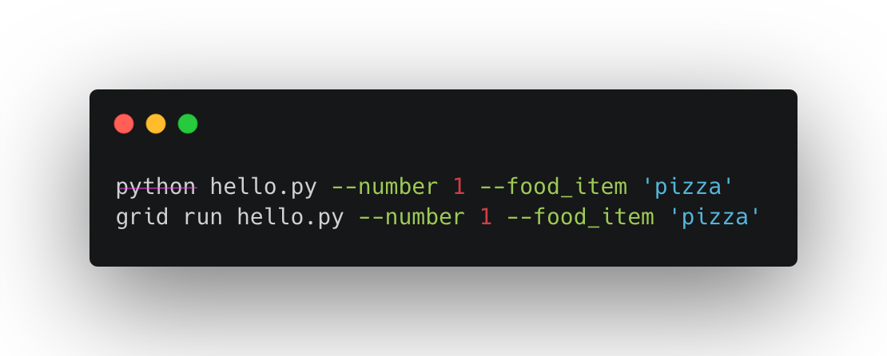
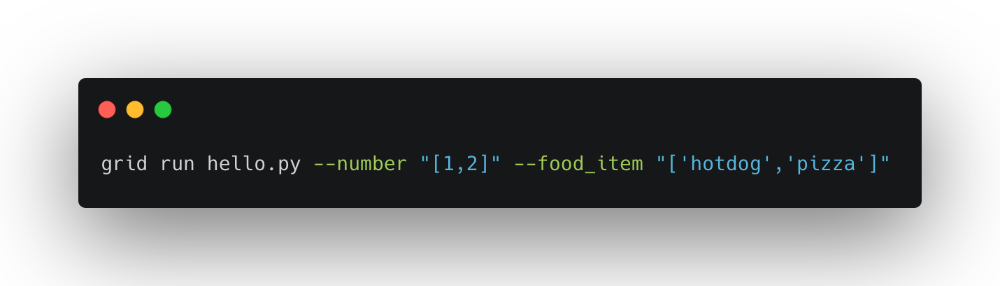
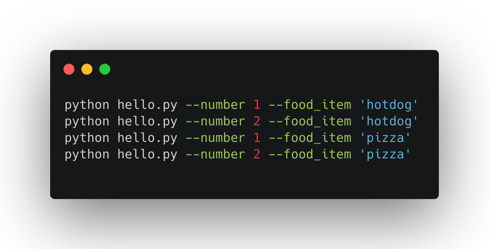
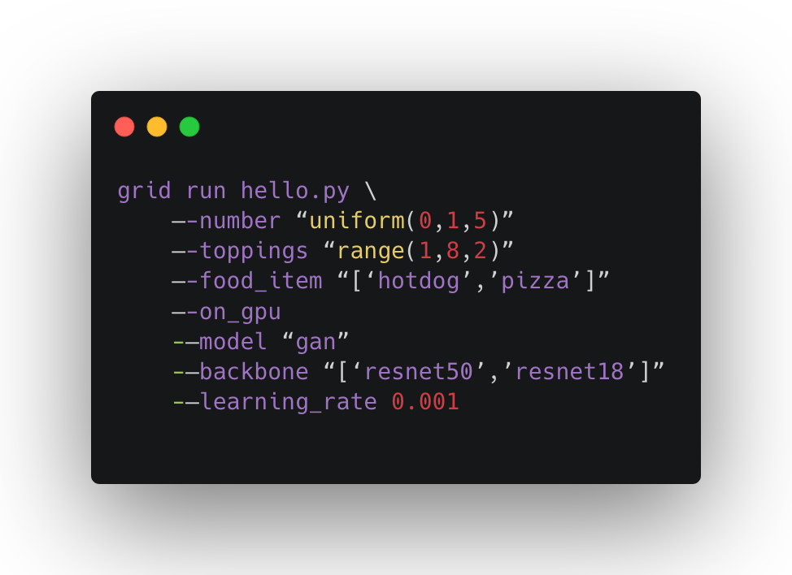
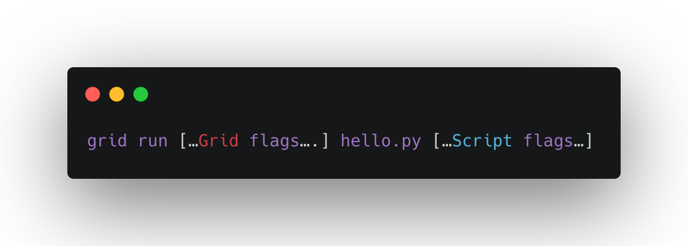
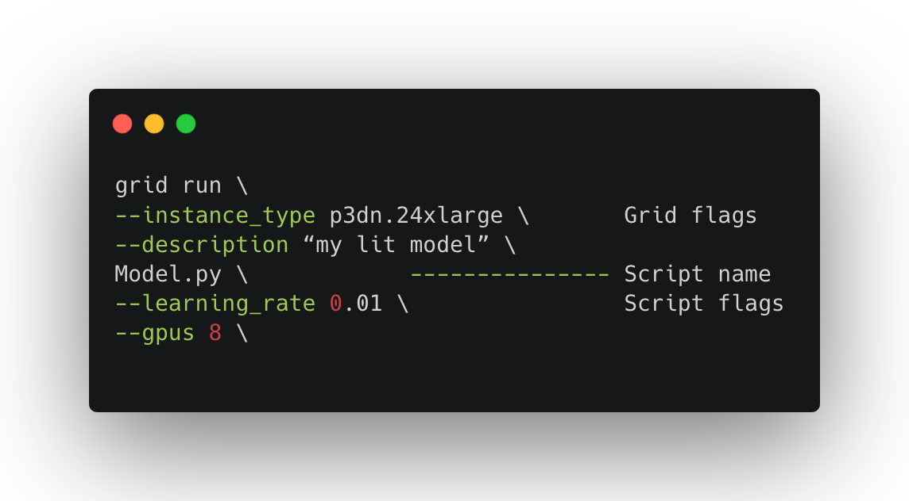

# grid run

## Remote execution


`grid run` executes a script on one or more **cloud** machines from your laptop.

Basically... think about it like replacing `python` with `grid run`




Projects must be hosted on **Github** for now. [Reach out](mailto:luis@grid.ai) for other cases.


## Hyperparameter sweeps

Grid run automates hyperparameter sweeps using our python-like syntax.

grid run and grid run are the same, you can use either one.

This command:



Is equivalent to these commands:



Our syntax adds support for any numpy distribution, lists, and the range operator:



## Command structure

A grid run command has the following structure:



Annotated Example 1: Run a script on 8 V100 GPUs



Example 2: Run 8 variations of this script, each on 8 GPUs

```bash
grid run \
--instance_type 8_v100_32gb \
model.py --learning_rate "uniform(1e-5, 1e-1, 4)" --layers "[2, 4]"
```


How many total GPUs will this command use?

$$
4 \text{ learning rates} \times 2 \text{ layer options} \times 8 \text{ GPUs} = 64 \text{ GPUs}
$$


## Hyperparameter sweep syntax

In addition to the standard python syntax, use the following syntax to automatically generate combinations of hyperparameters.

| Use case | Syntax | Description |
| :--- | :--- | :--- |
| Any list | --flag "\[0, 1\]" | Calls two scripts with --flag 0 and --flag 1 |
| String list | --flag "\['x', 'y'\]" | Calls two scripts with --flag 'x' and --flag 'y' |
| Any numpy distro | --flag "uniform\(0, 1, 3\)" | Calls 3 scripts with each sampled value |
| Generate a list of ints | --flag "range\(0, 5, 2\)" | Calls 3 scripts with: --flag 0, --flag 2, --flag 4 |

Example 1: Sample 8 floats and execute 8 scripts with each value

```text
# COMMAND
grid run model.py --flag "uniform(0, 1, 8)"


# EQUIVALENT (values are random uniform)
python model.py --flag 0.394
python model.py --flag 0.110
python model.py --flag 0.002
python model.py --flag 0.320
python model.py --flag 0.967
python model.py --flag 0.840
python model.py --flag 0.083
python model.py --flag 0.004
```

Example 2: Run a script per string value

```text
# COMMAND
grid run model.py --flag "['option a', 'option b', 'option c']"


# EQUIVALENT
python model.py --flag 'option a'
python model.py --flag 'option b'
python model.py --flag 'option c'
```

Example 3: Combine flags to automatically generate combinations

```text
# COMMAND
grid run model.py --flag "uniform(0, 1, 2)" --flag2 "['dog', 'no dog']"


# EQUIVALENT
python model.py --flag 0.394 --flag2 'dog'
python model.py --flag 0.110 --flag2 'no dog'
python model.py --flag 0.394 --flag2 'dog'
python model.py --flag 0.110 --flag2 'no dog'
```

Example 4: Regular python syntax still works

```text
# COMMAND
grid run model.py --do_x --val 1.0 --flag "['dog', 'no dog']"


# EQUIVALENT
python model.py --do_x --val 1.0 --flag 'dog'
python model.py --do_x --val 1.0 --flag 'no dog'
```

## Grid Flags

Here's a summary of all the available grid flags \(all are optional\)

| Flag | Description | Default |
| :--- | :--- | :--- |
| --cpus | number of CPUs per experiment | ? |
| --config | path to a yaml config file | - |
| --credential | specify the cloud credential to use | Grid Cloud |
| --datastore\_name | name of datastore to mount | - |
| --datastore\_version | version of datastore to mount | - |
| --datastore\_mount\_dir | directory where to mount datastore | /opt/datastore |
| --disk\_size | size of disk attached to machine | 200 GB |
| --description | additional context for this run | - |
| --framework | machine learning framework | - |
| --gpus | the number of GPUs per experiment | 0 |
| --instance\_type | defines number of GPUs and memory | ? |
| --max\_nodes | a fail-safe limit to avoid large workloads | 100 |
| --memory | machine RAM \(not GPU RAM\) | ? |
| --name | name of run | - |
| --strategy | grid search or random search | grid search |
| --trials | number of trials for random search | - |
| --ignore\_warnings | skips all warning and prompts | false |

### `--cpus`

Allocate a number of CPUs to each script call. This is perfect for distributed CPU workloads.

Example:

```text
grid run --instance_type 2_cpu_8gb --cpus 2 my_script.py
```


Leave 1 unused CPU for the Grid processes.


### **`--config`**

Path to a YML configuration for your run.

```text
grid run --config experiment.yml my_script.py
```


Refer to the [Grid YML Specification](grid-train.md) for YML details.


### `--credential`

Select the cloud credentials to use.

```text
grid run --credential cc-4dcd my_script.py
```


`View available credentials in`[Settings](https://987bcab01b929eb2c07877b224215c92.grid.ai/#/settings) or call `grid credential` in the CLI


### --datastore\_name

The name of the datastore

```text
grid run --datastore_name imagenet my_script.py
```

### --datastore\_version

The datastore version

```bash
grid run --datastore_name imagenet --datastore_version 2 my_script.py
```

### --datastore\_mount\_dir

The directory to mount a datastore

```bash
grid run --datastore_name imagenet --datastore_mount_dir /my_data/
my_script.py
```

Make sure wherever your script loads data points to that path

```bash
grid run --datastore_name imagenet --datastore_mount_dir /my_data/
my_script.py --script_data_path /my_data/
```

### `--description`

Optional description for a run

```text
grid run --description "Trying Adam optimizer" my_script.py
```

### `--disk_size`

Disk size to be attached to every experiment node. Number indicates Gb.

```text
grid run --disk_size 300 --my_script.py
```

### **`--gpus`**

Allocate a subset of the GPUs on a machine to each script call.

Example: Use 4 GPUs of a machine with 8 V100s.

```text
# COMMAND
grid run --instance_type 4_v100_16gb --gpus 4 \
my_script.py --flag "[1, 2]"

# Scripts share the same machine
python my_script.py --flag 1  # 4 GPUs
python my_script.py --flag 2  # 4 GPUs
```

Note a few things:

* Multiple scripts can share the same machine
* Make sure the instance type supports GPUs
* Make sure your script is enabled to use all GPUs available


PyTorch Lightning **automagically** detects available GPUs \(no --gpus flag needed\)


### **`--instance_type`**

AWS instance type to use when creating Run.

```text
grid run --instance_type 8_v100_32gb my_script.py
```

Here's a list of all the available machines



### `--memory`

Specify the CPU RAM for an experiment.

```text
grid run --memory 10G my_script.py
```


The G is required in \(1G, 10G, 1000G\)


### --name

Optional name for a run.

A name must:

* Be lowercase or '-'
* Start with a letter
* End with a letter or number

**Example**:

```text
grid run --name my-fancy-name my_script.py
```

### **`--strategy`**

Hyperparameter sweep strategy to use, either `grid_search` or `random_search`. If `random_search`, use the `--trials` parameter.


Example: Grid search \(runs all 4 variations\)

```text
# COMMAND (default is grid search)
grid run model.py --animal "['cat', 'dog']" --food '['pear', 'apple']' 


# EQUIVALENT
python model.py --animal 'cat' --food 'pear'
python model.py --animal 'cat' --food 'apple'
python model.py --animal 'dog' --food 'pear'
python model.py --animal 'dog' --food 'apple'
```

Random search only runs the number of trials specified

```text
# COMMAND (random search)
grid run --strategy random_search --trials 2 \ 
model.py --animal "['cat', 'dog']" --food '['pear', 'apple']' 


# Only 2 combinations chosen randomly (--trials 2)
python model.py --animal 'cat' --food 'pear'
python model.py --animal 'dog' --food 'apple'
```


Grid is working on adding bayesian strategies. Random search performs just as well most of the time.


### `--trials`

The number of trials to sample when. Only available when running `--strategy random_search`

### `--ignore_warnings`

Disables all warnings and prompts when starting runs.


Only disable this if you know what you are doing


