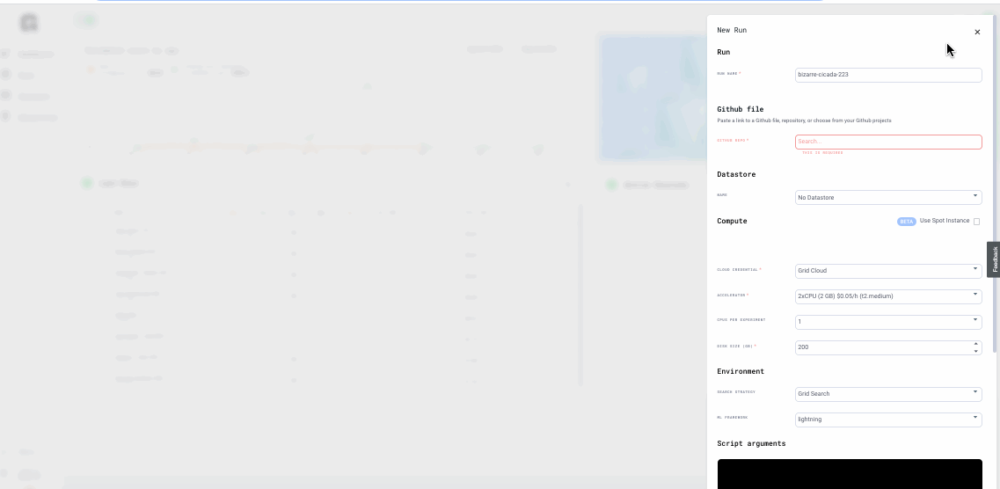

# Lowering costs \(BETA\)

## Interruptible machines

Cloud machines are normally expensive. However, if your job can support being interrupted at any time \(ie: fine tuning, model that can be restarted\) then you could use the _**spot instances**_ feature in Grid.

### Enable via the UI




### Enable via the CLI

```bash
grid run --use_spot pl_mnist.py
```

## Prepare code for interruptible

To take advantage of interruptible machines, make sure your code does a few things:

1. You are saving checkpoints or any state you need. Grid automatically picks these up into your artifacts.
2. Make sure your code can be restarted from a checkpoint or state file.

## Restarting interrupted jobs

Once the machine is interrupted, your job on Grid will stop. If you want to continue running your code do the following:

1. Navigate to your experiment artifacts.
2. copy the link to the state files \(or checkpoint\) that you need.
3. Resubmit the job with the path to that file.

For example, assume your script has an argument called **--ck\_path**

```bash
grid run --use_spot main.py --ck_path https://grid.ai/url/to/checkpoint.ckpt
```

