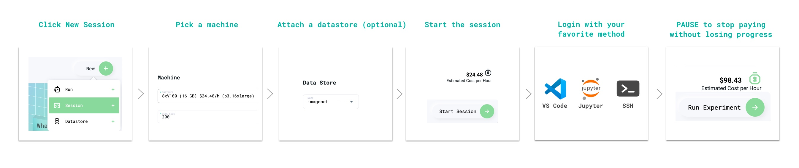
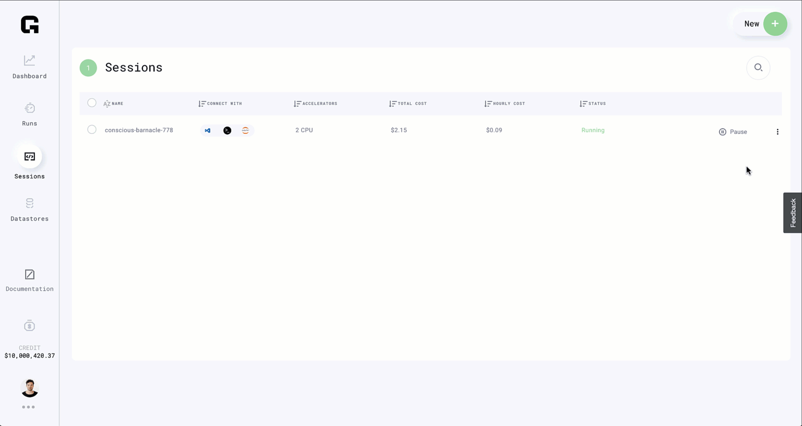

# ⚡Sessions

## Sessions

For prototyping/debugging/analyzing, sometimes you need a LIVE machine. We call these _Sessions_.

Session features:

* Mount multiple GPUs
* Auto-mount datastores
* Pre-installed Jupyter Lab
* SSH access
* Visual Studio Code access
* Pause the session to save work and pause expenses
* Resume where you left off

## Product Tour

[Click here for the 1-minute tour of Sessions](https://platform.grid.ai/#/dashboard?product_tour_id=221973)


## **Start a Session**




The equivalent via the CLI command:

```bash
# session with 2 M60 GPUs
grid session create --instance_type 2_m60_8gb
```

## Delete a Session



The equivalent CLI command:

```text
grid session delete $INTERACTIVE_NODE_ID
```

